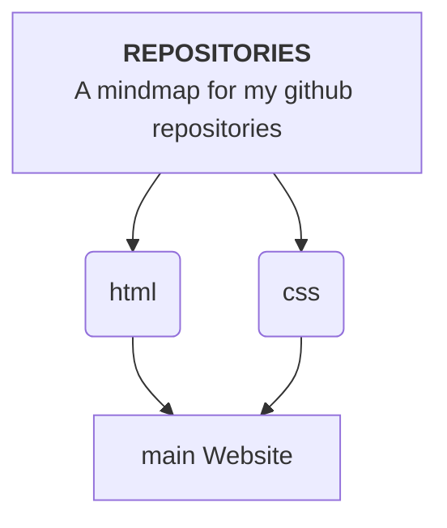

    <h1>
         
    </h1>

```mermaid
%%{init: {"flowchart": {"htmlLabels": false}} }%%
flowchart TD
markdown["`**REPOSITORIES**
A mindmap for my github repositories`"]    
markdown -->A(html)
markdown-->B(css)
A-->re1[main Website]
B-->re1
```

    

