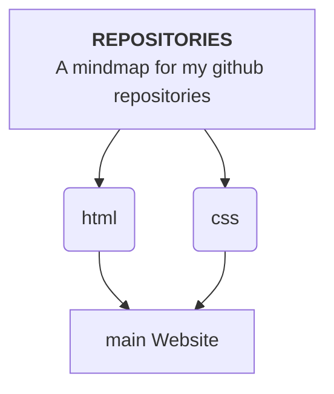

    <h1>
         
    </h1>

 <iframe title="HYPER VISUALS" frameborder="0" allowfullscreen mozallowfullscreen="true" webkitallowfullscreen="true" allow="autoplay; fullscreen; xr-spatial-tracking" xr-spatial-tracking execution-while-out-of-viewport execution-while-not-rendered web-share src="https://sketchfab.com/models/e5dbd3b77b294b5e98506a77a9ee676a/embed?ui_theme=dark"> </iframe> 
 <a href="https://sketchfab.com/3d-models/hyper-visuals-e5dbd3b77b294b5e98506a77a9ee676a?utm_medium=embed&utm_campaign=share-popup&utm_content=e5dbd3b77b294b5e98506a77a9ee676a" target="_blank" rel="nofollow" style="font-weight: bold; color: #1CAAD9;"> HYPER VISUALS </a> by <a href="https://sketchfab.com/hypervisuals?utm_medium=embed&utm_campaign=share-popup&utm_content=e5dbd3b77b294b5e98506a77a9ee676a" target="_blank" rel="nofollow" style="font-weight: bold; color: #1CAAD9;"> HYPERVISUALS </a> on <a href="https://sketchfab.com?utm_medium=embed&utm_campaign=share-popup&utm_content=e5dbd3b77b294b5e98506a77a9ee676a" target="_blank" rel="nofollow" style="font-weight: bold; color: #1CAAD9;">Sketchfab</a>

    

