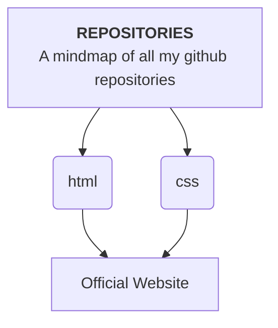

    <h1>
         
    </h1>

> # ABOUT ME
>Hey there iam hyper and this is my github profile. And the two things i love the most are coding and VFX.
>VFX grew as a hobby for me.i started messing around with softwares like blender and unreal engine.
>the other part of me just loves coding iam still in the making but i hope that one day i will be one of best AI + software Engineer

    

